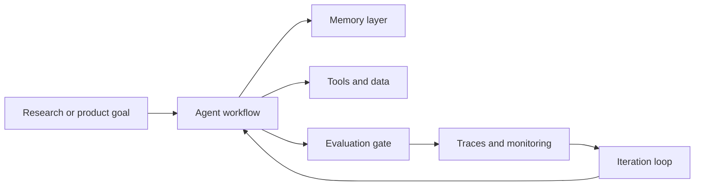

# Masoob Alam

**Agentic AI · MLOps · Quant Systems · Memory-layer R&D**

I design AI systems as composable architectures: agents with explicit state, durable memory, evaluation loops, observability and deployment boundaries. The work here is organized around how systems are structured, not just what they output.

## How I Think About Systems

Most agent projects fail at the seams: memory leaks into prompts, evaluation happens after release, and deployment is treated as an afterthought. I treat those boundaries as first-class design problems.

## Architectural Focus

- **Agentic orchestration** — explicit state, bounded tool use, human oversight and traceable decisions.
- **Memory design** — episodic, semantic and graph memory with conflict resolution instead of infinite context growth.
- **Evaluation-first ML** — metrics, gates and regression checks before a system is trusted.
- **Quant research systems** — backtesting, risk constraints and clear separation between research and execution.
- **Operational shape** — APIs, containers, CI and runbooks that a small team can actually run.

## Repositories

| Repository | Architectural theme |
| --- | --- |
| [`agentic-quant-lab`](https://github.com/mastroke/agentic-quant-lab) | Planner → simulator → risk engine → research report |
| [`memory-layer-rnd`](https://github.com/mastroke/memory-layer-rnd) | Multi-store memory with retrieval and conflict resolution |
| [`agentic-mlops-foundry`](https://github.com/mastroke/agentic-mlops-foundry) | API boundary, runtime, eval gate and deployment path |
| [`llm-finetuning-eval-lab`](https://github.com/mastroke/llm-finetuning-eval-lab) | Data → baseline → metrics → model card → CI gate |

## Stack

**Agents:** LangGraph-style workflows, role decomposition, RAG, tool calling, eval harnesses  
**ML/MLOps:** Python, FastAPI, Docker, GitHub Actions, experiment tracking  
**Quant:** pandas, NumPy, backtesting, risk metrics, RL research  
**Systems:** API design, ADRs, test strategy, operational runbooks

## Design Principles

- Architecture should make failure modes visible early.
- Memory is a contract, not a transcript dump.
- Agent autonomy requires evaluation, traces and rollback paths.
- Finance systems must separate research, paper trading and live execution.
- Good engineering shows up in docs, tests and explicit trade-offs.
